# EloEco - frontend
The repository contains an Ionic application, which based on your daily activities and trips helps you to track your ecological and carbon footprint.

# Installation

## Install dependencies

Please make sure npm and node.js are installed on your machine. 

```node --version```

```npm --version```

Install the dependencies listed in package.json:

```npm install```

## Run locally in your browser

Start the application:

```ionic server```

## Run on your device
In order to build the application for your Android device:

```ionic capacitor build android```

# Images
## Registration
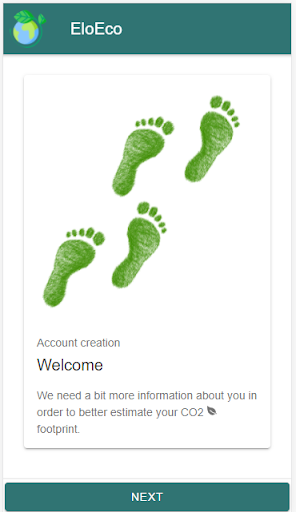
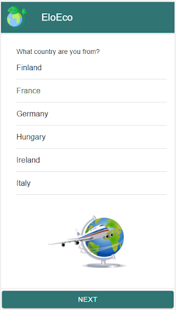
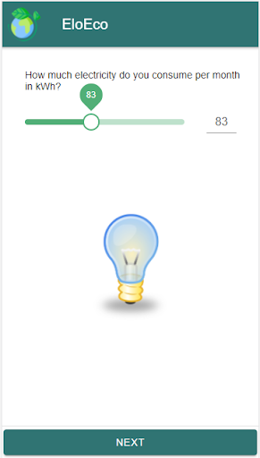
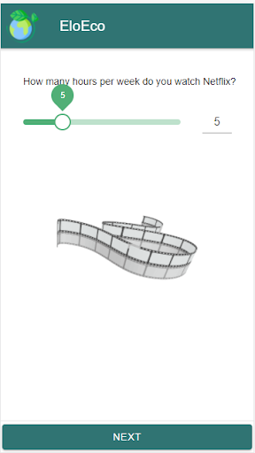
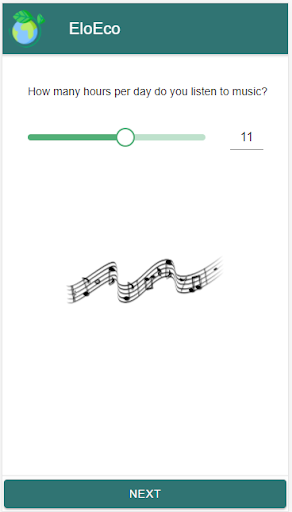
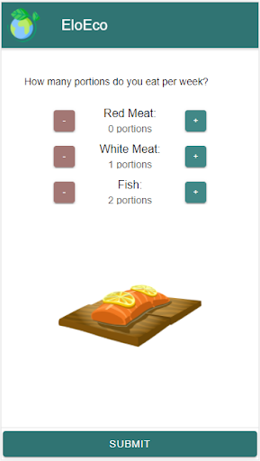

## Travel recording
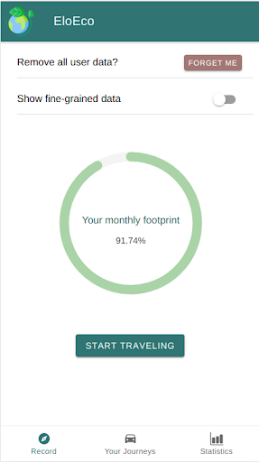
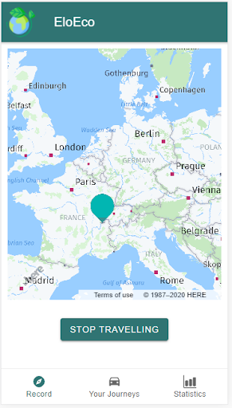
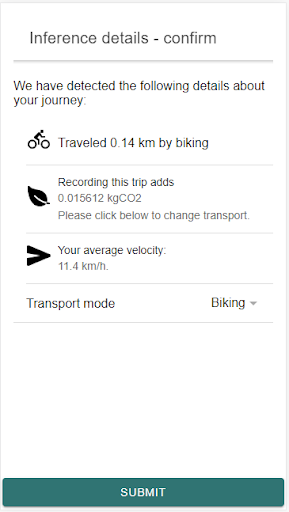
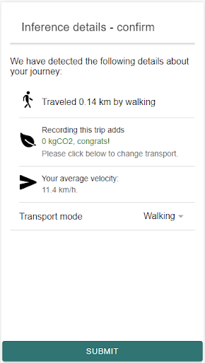
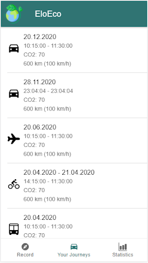
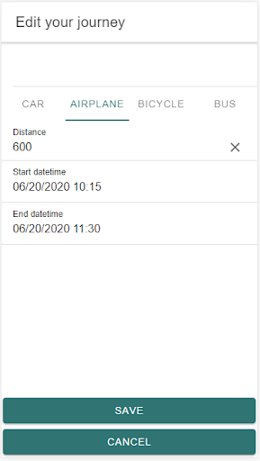

## Statistics
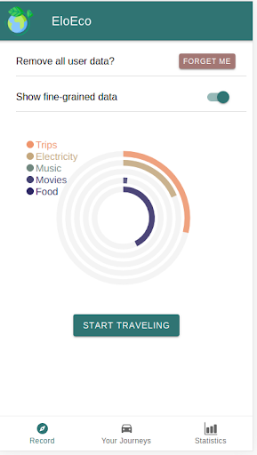
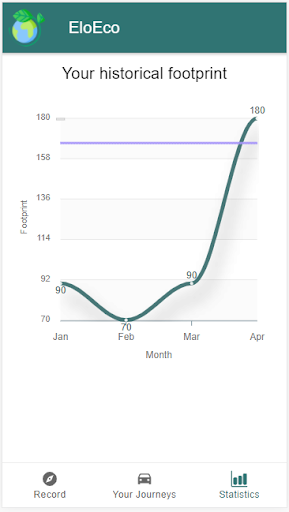

